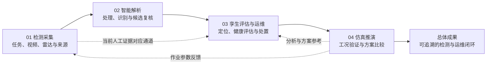

# 隧雷智检：系统建设思路与四阶段功能说明

本文说明本项目为什么要建设、为什么分为四个阶段，以及每个阶段针对什么问题、采用什么方式、形成什么成果。内容依据当前本地版本的平台和《计划.docx》，包含最新的现场视频与仿真左右对照、视频／雷达同源疑似位置对应、影像三维复核、健康评估和仿真推演功能。

本次发布同步纳入常驻疑似位置复核、原帧快速标记、同源人工示例和到点暂停功能。四个阶段的职责与现有交互保持一致；代码与说明发布到 GitHub，原始录像、模型和本地验收输出独立保管。在线入口以 README 所列 GitHub Pages 成功部署的内容为准。

文中分别说明“当前平台已经能够得到的结果”和“完整工程系统的建设目标”。当前平台以本地工作台为基础，接入真实文件与视频，提供人工复核、演示计算和算法扩展接口；工程算法、硬件控制和测量精度的完善属于后续建设内容。

## 一、我要建设一个什么系统，解决什么问题

本项目拟建设一个面向隧道衬砌检测与运维的“隧道智能检测与数字孪生平台”。系统把检测车采集、雷达与视频解析、病害空间定位、结构健康评估、风险处置和仿真验证组织到同一工作台，使检测数据能够逐步转化为有来源、有位置、有依据的运维决策。

需要解决的核心问题是：隧道检测得到的雷达回波、现场影像、病害记录和处置结果分散在不同环节，原始数据到病害判断、病害判断到风险评估、风险评估到治理措施之间缺少连续、可复核的关联。

具体问题与系统设计的对应关系如下。

| 需要解决的问题 | 造成的影响 | 系统采取的办法 |
|---|---|---|
| 视频、雷达、任务和里程信息缺少统一关联 | 难以确定数据属于哪次检测、哪个任务和哪段隧道 | 按项目、批次、任务和来源组织采集数据，保留时间、测线和定位依据 |
| 钢筋杂波、噪声和二维图像影响异常判断 | 异常容易被遮蔽，候选病害需要进一步核实 | 设计预处理、杂波抑制、偏移成像、病害识别和影像三维复核流程 |
| 视频中的异常与三维场景中的标记缺少对应 | 容易出现疑似位置与出现顺序不一致 | 以原始帧或固定雷达快照为证据，统一疑似点编号、时间和坐标；类型由第二阶段识别与复核 |
| 病害清单缺少健康评估与处置关联 | 难以确定优先处理的区段和后续治理步骤 | 量化病害，组合赋权计算 SHI，形成风险分级、预警和治理记录 |
| 采集参数和治理方案缺少比较依据 | 现场试错成本高，方案取舍难以解释 | 对雷达样本、车辆作业、结构响应和运维方案开展参数化推演 |

系统的总体目标是形成一条可追溯的业务链：**采到数据 → 解析异常 → 定位与评估病害 → 比较方案并验证 → 形成处置与报告**。

## 二、为什么分为四个阶段

四个阶段对应计划书的四部分，也对应平台目前保留的四个业务模块。前一阶段整理出后一阶段需要的输入，第四阶段的验证结果再反馈到采集和运维环节。

| 阶段 | 核心任务 | 要回答的具体问题 | 阶段成果 |
|---|---|---|---|
| 01 检测采集 | 管理任务、设备、现场视频和雷达数据 | 数据从哪里来，属于哪个任务，候选异常在原始证据中的什么位置 | 可用采集数据、来源记录、候选证据和作业场景 |
| 02 智能解析 | 预处理、算法接入、病害整理和影像三维复核 | 疑似点属于什么异常，原始信号如何被提取、识别和复核 | 处理记录、病害信息及可核对的影像／三维证据 |
| 03 孪生评估与运维 | 工程定位、健康评估、预警治理和报告 | 病害分布在哪里，风险有多大，应当怎样处置 | 三维病害分布、评估结果、预警治理记录和检测报告 |
| 04 仿真推演 | 比较采集工况、结构响应和运维方案 | 参数和措施是否合适，改变方案后结果如何变化 | 可复现样本、作业验证摘要、结构分析参考和方案推荐 |

图中的实线表示系统建设的主流程。当前已实现的人工证据对应通道，可把第一阶段保存的现场候选直接用于第三阶段的空间展示与原证据回溯；候选的自动识别与工程量化继续由第二阶段的算法链承担。

## 三、第一阶段：检测采集——把现场数据整理成可靠输入

**对应页面：检测任务与设备、雷达数据管理。**

这一阶段解决采集数据分散、任务关联不清，以及真实画面与仿真展示难以核对的问题。先明确检测范围和设备组成，再接入视频与雷达，最后保留能够复查的原始证据和候选位置。

### 1. 针对具体问题设计的子阶段与方式

| 子阶段 | 针对的问题 | 设计方式 | 得到的结果 |
|---|---|---|---|
| 1.1 检测任务与设备配置 | 检测范围、作业参数和所需设备不明确 | 设置任务名称、起止里程、速度、扫描间距、环向扫描角和障碍物；设备示意展示检测车、雷达、影像、定位、边缘终端和安全辅助六类配置 | 明确的任务范围、作业参数及设备组成 |
| 1.2 现场影像接入 | 需要观察原始画面，并区分录像与实时输入 | 接入本地录像、网络视频／MJPEG、摄像头／采集卡，保留来源、接入状态、时间和截图记录 | 可播放的现场画面与可追溯的影像证据 |
| 1.3 雷达数据接入与归档 | 雷达矩阵、标定信息和采集关联难以统一 | 导入 CSV／JSON，读取 HTTP／WebSocket 网关帧，检查矩阵和元数据；将需要处理或取证的网络帧保存成固定快照 | 可预览、可处理、可导出的雷达数据与元数据 |
| 1.4 原始证据中的候选标注 | 仅有画面或回波，缺少明确的病害对应索引 | 视频在常驻栏打开原帧标记对话框，或冻结已保存雷达快照，只点击疑似位置，记录时间／像素点或道号／采样点，形成 E- 编号；视频不选择病害类型 | 关联原证据、出现顺序与定位依据的疑似点记录；类型待识别 |
| 1.5 现场与作业场景对照 | 上下切换视图不便，仿真标记容易与真实来源脱节 | 桌面左侧视频、右侧仿真等高对照；常驻顺序栏列出疑似点，点击编号同步回到原帧与仿真坐标，并支持到点暂停复核；雷达对应复核使用同一份矩阵和标记 | 可直接核对疑似点顺序和位置的工作区，不在采集阶段判断类型 |

视频有时长时，可按录像相对进度映射任务里程，并根据镜头方向设置画面与环向位置的对应关系；有真实定位依据时可填写人工工程位置。雷达可按道号顺序建立相对位置，也可结合测线标定进行换算。两种方式都保留定位依据，便于后续检查。

有固定时长的录像可先开启进度联动：不要求疑似点、类型或算法输出，勾选即对齐当前位置，车辆随播放、暂停和进度拖动同步。记录疑似位置后，现场视频与作业场景再共用这些记录；仿真以青绿中性点显示编号、顺序和位置，不猜测类型或形状，车辆按相同顺序经过候选标记。定位后的任务进度、相对距离与状态同步刷新；第一人称、启停、车载 HUD、背景、图层和全屏继续提供作业观察功能。

为避免只看到录像和车辆同步、看不到待复核位置，对照区上方常驻疑似位置栏，显示本视频记录数、编号、出现时间、相对里程和下一处提示。操作者可直接在原帧选点保存，也可点击编号或开启“到点暂停复核”，按相同先后顺序检查原像素位置与三维定位点。原证据面板保留工程坐标修订、多帧关联与 JSON 备份。

三段本地隧道视频支持显式载入人工预选的复核位置，按完整文件指纹匹配，并从当前录像取真实缩略帧；不会给任意新视频自动填病害。同一示例重复载入不重复计数，取帧期间换源或换任务取消本次写入。点击人工修订过工程坐标的点时会关闭连续相对进度联动，以保留修订后的车辆定位；不再按旧时间比例覆盖人工坐标。这些位置包含待检查的接缝和表观变化，是复核索引，不是自动检测结果或确诊病害；第一阶段仍输出未分类证据，第二阶段负责识别和专业复核。

### 2. 第一阶段结束时得到什么

得到一组按批次、任务和来源组织的采集成果：**检测任务与参数、视频及截图来源、雷达矩阵与固定快照、标定信息、未分类疑似点证据索引（时间、像素点、相对坐标与定位依据），以及可观察的作业过程**。

这些成果分别进入第二阶段的数据解析和第三阶段的现场候选展示。原始视频和完整矩阵需要作为独立原始文件保存，候选记录则保留指向原证据的关联。

**当前实现范围：**平台已能接入浏览器支持的视频与规范化雷达数据，进行归档、标注和场景对应；检测车及机械臂在平台中提供参数化作业演示，真实车辆控制和专有 GPR 设备协议属于后续接入内容。

第一阶段的验收重点是“拍摄与位置记录”：原视频的点击像素与出现时间可回看，常驻栏及逐点停帧能核对出现顺序，仿真只显示同一编号和顺序的定位点。新视频 `type=null`，`classificationStatus="pending"`；已有分类不被擦除，对应 JSON 升级为 schema 2 并兼容 schema 1。固定机位或非匀速拍摄不能仅靠时间恢复实测里程，同一物理位置在多帧出现应关联已有编号。

本轮已将非隧道验证素材全部撤回，改用三段真实隧道检测作业视频：轨道隧道扫描的设备近景与人员跟拍，以及高速公路隧道车载探地雷达检测。两段轨道隧道素材来自同一作业，不代表三个独立工程样本。共记录九条未分类待复核位置；只在原始隧道拍摄画面选点，车载示例采用 10 / 14 / 18 秒，不在隧道外道路或软件演示画面选点。接缝、痕迹仍属于待判断的观测，不宣称确诊病害；顺序与相对位置对应不等于识别准确率或工程定位精度。车载原片为 HEVC，保留完整原片与未裁剪视频画幅、时序的 H.264 播放副本。

## 四、第二阶段：智能解析——把原始数据转化为有依据的病害信息

**对应页面：智能处理工作流、病害清单与复核、隧道影像三维复核。**

这一阶段解决雷达信号难以直接解释、病害信息缺少统一表达，以及影像候选需要多角度验证的问题。计划中的技术路线是预处理和杂波抑制、偏移成像、识别量化、候选复核，逐步形成能够用于工程定位与评估的病害信息。

### 1. 针对具体问题设计的子阶段与方式

| 子阶段 | 针对的问题 | 设计方式 | 得到的结果 |
|---|---|---|---|
| 2.1 输入校验与数值预处理 | 信号背景和幅值差异影响后续解析 | 从雷达目录选择固定输入，执行背景均值去除、时间增益，查看处理前后 B-scan 与单道波形 | 处理后的矩阵、参数和处理记录 |
| 2.2 钢筋杂波抑制 | 钢筋回波可能遮蔽内部异常 | 按计划预留 RCAN 杂波抑制环节，明确输入、输出、参数和模型版本；当前接口处于待接入状态 | 当前形成接入配置；工程目标是得到杂波抑制结果 |
| 2.3 雷达成像接口与影像病害识别 | 回波异常需要成像，原始影像需要提取病害候选 | 雷达保留 RTM 参数与接口检查；影像检测采用独立的 crack-seg U-Net 裂缝分割流程，结合重建与射线定位 | 雷达形成参数记录；独立影像流程输出裂缝掩码、候选与定位结果，尚未自动写入工作台 |
| 2.4 病害清单与人工复核 | 候选需要按统一字段整理，并保留审核依据 | 按编号、类型、里程、环位、尺寸、埋深、置信度和来源组织信息，提供筛选、详情、定位及复核入口 | 可查询、可复核的病害台账与复核状态 |
| 2.5 隧道影像三维复核 | 单帧候选难以确定是否有足够证据 | 查看多场景案例、原始／规则化表面、候选位置、同帧掩码和相邻帧，核对影像与三维表面 | 候选的影像与空间证据、人工复核依据 |

**隧道影像三维复核属于第二阶段。**它用于检查识别候选与原始影像、邻帧和重建表面之间的关系；第三阶段承接整理后的病害信息，进行工程位置展示、健康评估和运维管理。

平台当前提供多场景总览、DVP 手持、铁路短片、铁路长片和 TUM VI 鱼眼案例。视频重建、裂缝候选和三维定位脚本在独立算法目录中运行，现有案例用于复核展示；主工作台导入录像的操作本身不触发自动重建。

### 2. 第二阶段结束时得到什么

第一阶段输入的是原始资料与未分类疑似点；判断类别属于本阶段。现有 crack-seg U-Net 主要提供裂缝分割候选，其他类别的工程识别仍需接入；当前不自动读取采集 E- 记录或将识别结果回填。

当前可以得到：**实际数值预处理结果、处理参数与记录、内置演示病害清单、复核状态，以及已有案例的影像三维证据**。当前主清单沿用演示台账，现场 E- 标注通过独立对应记录保存。

完成工程算法接入后，本阶段的目标成果是：**病害清单（类型、位置、尺寸、埋深、置信度及来源）、杂波抑制结果、偏移成像图、具有尺度和坐标依据的隧道三维重建成果**。

病害信息随后交给第三阶段。尺寸、置信度和测量坐标需要来自算法结果、标定或人工测量，当前人工相对标注主要保证证据对应关系。

## 五、第三阶段：孪生评估与运维——把病害信息转化为风险与处置依据

**对应页面：三维数字孪生、结构健康评估、预警与治理、检测报告。**

这一阶段解决病害位置不直观、风险评价缺少统一口径，以及预警到治理缺少记录衔接的问题。利用统一病害记录组织空间展示，并对具备量化信息的数据开展健康评估和处置管理。

### 1. 针对具体问题设计的子阶段与方式

| 子阶段 | 针对的问题 | 设计方式 | 得到的结果 |
|---|---|---|---|
| 3.1 三维工程定位与证据回溯 | 清单中的病害难以对应隧道空间位置 | 用同一编号关联里程、环向角、埋深与 X/Y/Z，在三维、展开图和横断面展示；现场记录可返回原视频位置或原雷达快照 | 可定位、可点选、可返回原证据的病害分布 |
| 3.2 病害量化与组合赋权 | 病害类型、尺寸和位置对健康状态的影响需要统一表达 | 按现有规则归一化类型、尺寸、浅埋和环向位置指标，使用 AHP、熵权及组合系数计算权重，检查一致性 | 指标、权重和可解释的评估配置 |
| 3.3 SHI 与风险分级 | 单个分数难以反映区段差异和局部严重病害 | 计算单体、区段和全隧道健康指标，结合风险阈值与局部严重规则；按同一配置比较历史批次 | 健康指数、风险等级、风险区段和历史比较 |
| 3.4 预警与治理闭环 | 告警之后的确认、处理和复检容易脱节 | 记录预警确认、治理处置、复检证据和关闭状态，关联病害编号、批次和治理任务 | 可追踪的预警与处置记录 |
| 3.5 检测报告与成果导出 | 评估和治理成果需要保存、复查和汇报 | 导出病害 CSV、项目 JSON、离线 HTML 报告，使用浏览器打印为 PDF；现场对应关系可单独导出与导入 JSON | 可保存、可复核、可汇报的成果文件 |

本阶段保持两种明确的数据用途：现场标注模式展示 E- 候选的类型、坐标和证据；原有演示台账模式提供健康评估、历史比较和预警处置演示。现场候选当前尚未自动参与演示 SHI，后续需补齐工程量化、确认状态和评估依据，再形成正式的评估输入。

### 2. 第三阶段结束时得到什么

得到：**病害三维分布与证据关联、健康评估配置及 SHI、风险区段、治理记录、历史比较和检测报告**。每项结果保留数据来源与评估口径，使人员能够从风险结果回到病害，从病害回到证据。

其中，当前现场标注提供真实原帧／固定快照与明确坐标关系；健康评估和治理流程以现有演示台账及演示判据运行。工程应用需要将经确认、具有测量依据的病害数据接入该评估链。

## 六、第四阶段：仿真推演——对作业参数和治理方案进行比较验证

**对应页面：仿真验证工作台的“雷达样本、作业验证、结构响应、运维方案”四个页签。**

这一阶段解决采集参数难以比较、作业覆盖与障碍工况缺少检查，以及结构和治理方案需要对照分析的问题。通过保存工况、改变参数、比较结果和导出摘要，为下一轮采集与运维安排提供参考。

### 1. 针对具体问题设计的子阶段与方式

| 子阶段 | 针对的问题 | 设计方式 | 得到的结果 |
|---|---|---|---|
| 4.1 可复现雷达样本 | 需要可重复的输入检验显示、预处理和参数变化 | 调整示意几何、介电参数、噪声和随机种子，生成雷达矩阵，保存参数、种子和示意标签 | 可复现的示意样本及样本 JSON |
| 4.2 车辆避障与作业验证 | 速度、扫描间距和障碍物影响作业时间及覆盖 | 共用检测任务的车辆与障碍参数，计算直行停障、覆盖率、作业时间及漏检区间，并应用到场景 | 工况参数、作业验证摘要和可观察的作业结果 |
| 4.3 结构响应与外部分析参考 | 荷载和结构参数改变时需要比较响应 | 计算简化闭合圆环的应力和位移，比较压力、半径、厚度和模量变化；可导入外部有限元结果 JSON | 参数敏感性结果、分析摘要和外部结果展示 |
| 4.4 运维方案比较 | 不同措施在预算、工期和预期降险上存在取舍 | 调整预算和成本／工期／降险权重，比较复检监测、分段注浆及综合修复方案 | 方案排序、预算可行性与推荐参考 |

第一阶段的车辆场景用于观察当前采集作业及证据对应；第四阶段的作业验证用于改变工况、计算指标和比较方案。两处共用车辆和任务参数，使验证结果能够应用回检测任务。

### 2. 第四阶段结束时得到什么

得到：**示意雷达样本与参数、车辆作业验证摘要、结构响应分析参考、运维方案比较结果，以及可应用到采集任务的作业参数**。这些结果与第三阶段的治理记录配合，支持下一轮任务安排和方案复核。

计划书中的“仿真数据集、避障与作业验证报告、承载力分析结论、运维方案推荐”是本阶段的完整建设目标。当前雷达样本采用程序纹理生成，车辆采用简化几何停障，结构采用均匀外压圆环模型，方案比较采用演示成本与降险假设；工程承载力结论需进一步引入具有验证依据的结构模型、工况和求解结果。

## 七、四个阶段怎样关联，避免各自形成孤立功能

阶段之间通过来源和业务记录衔接，具体关系如下。

| 衔接关系 | 传递什么 | 当前平台的实际衔接方式 |
|---|---|---|
| 第一阶段 → 第二阶段 | 固定雷达输入、元数据、任务与来源 | 保存的雷达快照可作为智能处理输入，保留数据编号和处理参数 |
| 第一阶段 → 第三阶段 | 视频／雷达疑似点编号、顺序、坐标和原证据；新视频类型留空 | E- 对应记录在作业场景与数字孪生中共用，支持展开、横断面和原证据回溯 |
| 第二阶段 → 第三阶段 | 病害台账、复核状态和空间定位依据 | 现有演示清单可定位到孪生并联动评估；独立算法成果后续需建立正式接入关联 |
| 第三阶段 → 第四阶段 | 风险信息、作业需求和治理目标 | 用于选择比较工况和措施；当前方案推演通过用户设置预算与权重开展演示比较 |
| 第四阶段 → 第一阶段 | 调整后的车辆作业参数 | 车速、扫描间距和障碍工况可应用回检测任务 |
| 第四阶段 → 第三阶段 | 作业摘要、结构参考与方案比较结果 | 用于人员复核、治理登记和报告参考，结构分析尚未自动改写 SHI |

共同的关联依据包括：**项目与批次、检测任务、原始来源编号、病害编号、里程和环向坐标、处理参数及评估版本**。切换任务或来源时，平台按对应范围展示记录；网络持续更新的帧与已保存证据快照分开管理。

视频与仿真的对应首先保证原证据中的疑似位置、出现顺序与映射坐标一致，不要求在第一阶段判断病害类型；工程位置准确性进一步依赖里程、姿态和尺度标定。这样的分层关系既保留当前可验证的人工复核通道，也为后续自动解析留出清楚的数据接口。

## 八、总体最后得到什么

完整系统最终要形成一套“采集—解析—定位评估—验证—处置”的检测与运维成果体系。

| 总体成果 | 包含什么 | 带来的作用 |
|---|---|---|
| 1. 可追溯的检测数据包 | 任务、批次、视频、雷达、时间、标定和来源记录 | 解释数据从哪里来，并支持重新解析 |
| 2. 有证据的病害信息 | 病害编号、类型、位置、量化字段、原始证据和复核状态 | 支持核实病害判断及其空间位置 |
| 3. 可交互的隧道数字孪生 | 病害分布、三维坐标、展开图、横断面和原证据入口 | 把病害信息放回隧道空间进行理解和检查 |
| 4. 可解释的健康与风险结果 | 指标、权重、SHI、风险等级、区段及历史比较 | 为处理优先级和复检安排提供依据 |
| 5. 可比较的作业与运维方案 | 工况、覆盖、时间、结构参考、预算和方案排序 | 支持选择采集参数与治理措施 |
| 6. 可留存的处置与报告成果 | 预警、治理、复检、关闭记录及 CSV／JSON／HTML／PDF 文件 | 支持结果汇报、过程追踪和后续复查 |

**当前版本已经形成的总体成果**是一个可在本地运行的四模块工作台：能够接入真实视频和规范化雷达数据，保存未分类视频疑似点并在视频、作业场景和数字孪生之间保持编号、顺序与位置对应，开展数值预处理、演示健康评估、治理记录、简化推演和文件导出。原有第一人称、启停、HUD、图层、背景与返回导航共同服务这些业务过程。

**完整工程系统的最终成果**是把经过标定、识别和确认的现场病害纳入统一评估与处置链，使每项病害判断能够找到原始证据，每项风险结论能够找到计算依据，每项治理措施能够找到方案比较和复检记录。

## 九、编写依据与相关文档

本文依据当前本地页面、计算逻辑和下列项目材料编写。界面操作步骤、文件格式和开发验收分别见对应文档。

- [项目计划书](../计划.docx)：四个阶段的原始建设安排。
- [README.md](README.md)：当前模块、功能入口和实现状态。
- [平台使用说明.md](平台使用说明.md)：操作步骤、计算口径和导出范围。
- [平台架构与使用流程.html](平台架构与使用流程.html)：系统架构、模块关联与分步流程。
- [真实算法与数据接入说明.md](真实算法与数据接入说明.md)：雷达、候选证据和算法接入边界。
- [算法与重建说明](algorithm/README.md)：独立算法、影像重建和定位流程。
- [验证记录.md](验证记录.md)：当前功能与交互的本地验收结果。
